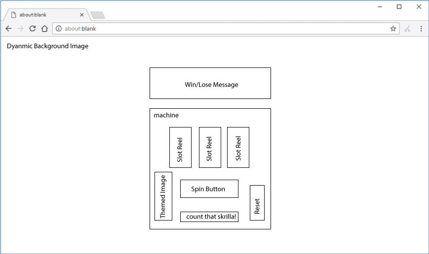
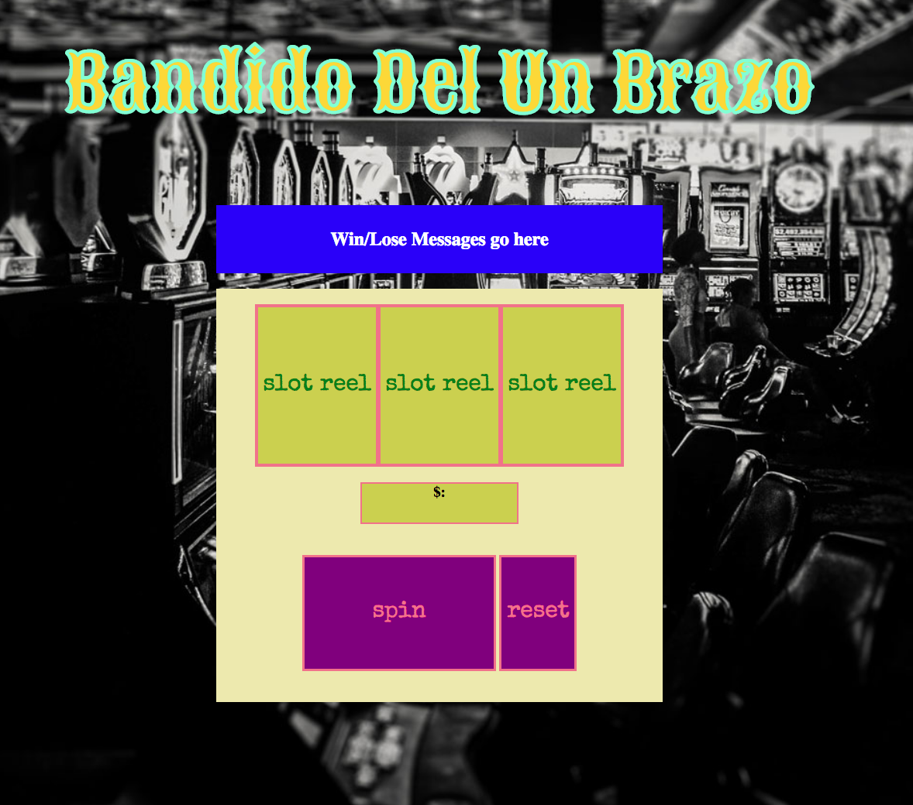

#  One Armed Bandit

//initialize gameboard  
//display three slot reels, win or lose message, payout counter, spin button, game reset  
//start with defined amount of money that redues an specific amount each turn  
//listen for spin click and iterate through a randomized numerical pattern  
//return one number per "slot" (three in total)  
//check for a matching pattern  
//if matching display win message and add to payout if lose display lose message and remove defined amout of winnings  
//allow repetitive palying until user hits restart button  
//stop game if user runs out of money  

icebox:  
gif's and flashing lights with wins or losses  
images instead of numbers displayed in slot reel  
make gameplay goal oriented  
  
  //symbols = [ {img: value: weight:} {} ]  
  //set timeout per reel? for spin stop    

//load empty slot reels (null)  
//let $ = 100  
//bet parseInt $1, $5, $10   
//reduce $ -= bet per spin  
//    
