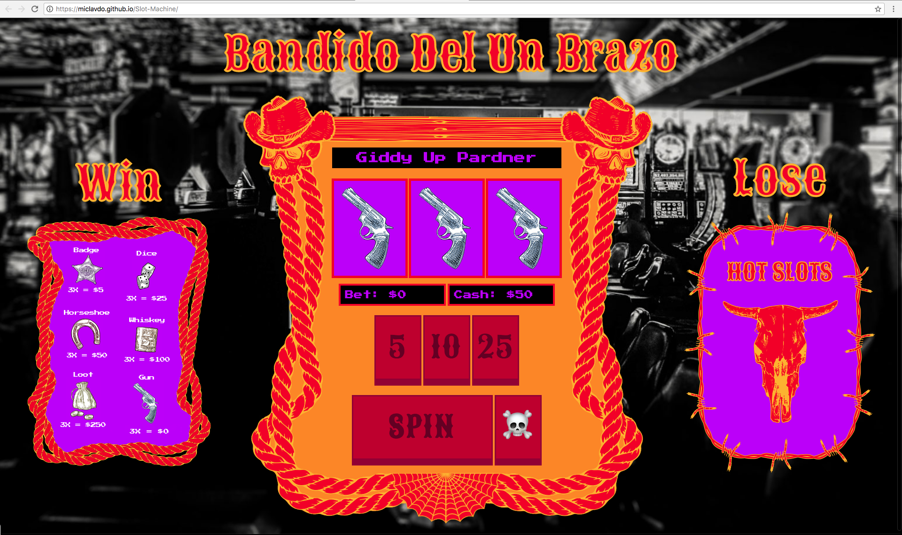

# Bandido Del Un Brazo

## Description  
Bandido Del Un Brazo (Bandit of the One Arm) is a wild west themed game based on Slot Machines, a casino gambling machine with three or more reels which spin when a button is pushed. Slot machines are also known as one-armed bandits because they were originally operated by one lever on the side of the machine and because of their ability to leave the player impoverished or in debt.

 ## Technologies Used  
 * HTML
 * CSS
 * JavaScript  
 * Adobe Creative Suite

## Getting Started 
Head over to https://miclavdo.github.io/Slot-Machine/ to test it out.

## Next Steps  
* Revise ( &#9760; )  Reset button functionality
* Fix Spin increase bug 
* Format for mobile use
* streamline weighting logic
* Make gameplay more goal oriented 